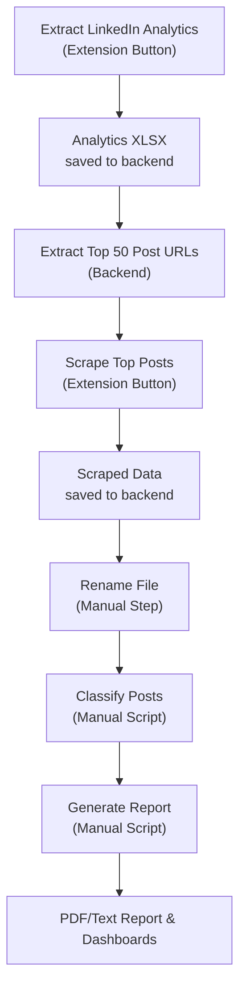

# Prisma: LinkedIn Content Analysis Automation

## Overview
This project automates the analysis of LinkedIn content performance using a Chrome extension and a Python backend. It enables you to extract analytics, scrape top posts, classify content with an LLM, and generate actionable reports.

---

## Prerequisites
- **Python**: 3.10+
- **Chrome browser** (latest recommended)
- **OpenAI API key** (for classification and report generation)
- **OS**: macOS, Linux, or Windows (tested on macOS)

---

## Quick Start

### 1. Install and Run Backend
```bash
cd backend
pip install -r requirements.txt
python server.py
```
Backend will run at [http://127.0.0.1:5000](http://127.0.0.1:5000)

**Verify**: Visit [http://127.0.0.1:5000/top-posts](http://127.0.0.1:5000/top-posts) to confirm the backend is working

### 2. Load Chrome Extension
- Go to `chrome://extensions` in Chrome
- Enable Developer Mode
- Click "Load unpacked" and select the `chrome_extension/` directory
- Make sure you are logged into LinkedIn in Chrome

### 3. Extract LinkedIn Analytics
- Click the "Extract LinkedIn Analytics" button in the extension popup
- The analytics XLSX will be uploaded to the backend and saved in `backend/data/`

### 4. Scrape Top Posts
- Click the "Scrape Top Posts" button in the extension popup
- The extension will scrape the top 50 posts (as determined from the analytics XLSX)
- Scraped data is stored in `backend/data/scraped_posts.jsonl`
- **Progress monitoring**: You can monitor scraping progress in Chrome's extension service worker logs

### 5. Classify & Analyze (Manual Backend Steps)

#### **Classify Posts:**
```bash
cd backend
source .venv/bin/activate
python content_analysis/linkedin_post_classifier.py --input data/scraped_posts_CreatorName.jsonl
```
**Output**: `backend/data/classified_posts_CreatorName.jsonl`

#### **Generate Report:**
```bash
cd analysis
source venv/bin/activate
python generate_linkedin_report.py
```
**Output**:
- `reports/linkedin_report_CreatorName_timestamp.txt` (text summary)
- `reports/linkedin_report_CreatorName_timestamp.pdf` (PDF with charts and LLM insights)
- `report_images/` (visualizations)
- `llm_prompt.txt` (LLM prompt for reference)

---

## Analyzing Other Creators' Content

### Alternative Workflow (Manual Data Placement)
If you want to analyze content from a creator other than yourself:

1. **Place Analytics File Manually**
   - Copy the creator's LinkedIn analytics XLSX file to `backend/data/`
   - Ensure the filename follows the pattern: `Content_YYYY-MM-DD_YYYY-MM-DD_CreatorName.xlsx`
   - Example: `Content_2024-06-30_2025-06-29_DavidStepania.xlsx`

2. **Verify Data is Loaded**
   - Visit [http://127.0.0.1:5000/top-posts](http://127.0.0.1:5000/top-posts)
   - Confirm you see the creator's name and post URLs listed

3. **Proceed with Scraping**
   - Click the "Scrape Top Posts" button in the extension popup
   - The extension will scrape posts for the creator whose analytics file is in the data folder

4. **Rename Scraped File (Important!)**
   ```bash
   cd backend/data
   mv scraped_posts.jsonl scraped_posts_CreatorName.jsonl
   ```
   **Example**: `mv scraped_posts.jsonl scraped_posts_David_Stepania.jsonl`

5. **Continue with Classification and Report Generation**
   - Follow steps 5-6 from the main workflow above

### Important Notes
- The backend automatically uses the **most recently modified** XLSX file in `backend/data/`
- To switch between creators, either:
  - Replace the XLSX file, or
  - Update the file's timestamp: `touch backend/data/CreatorName.xlsx`
- **File Naming**: Always rename scraped files to include the creator name for proper classification
- Monitor scraping progress in Chrome's extension service worker logs
- The scraping process may take several minutes depending on the number of posts

---

## Workflow Diagram


---

## Backend Endpoints (Quick Reference)

| Endpoint                        | Purpose                                 |
|----------------------------------|-----------------------------------------|
| `/top-posts`                    | List of top 50 post URLs (from XLSX)    |
| `/dashboard`                    | Scraped posts dashboard                 |
| `/classified-dashboard`         | Classified posts dashboard              |

---

## Directory Structure & Virtual Environments

### **Backend Directory** (`backend/`)
- **Virtual Environment**: `.venv/`
- **Classification Script**: `content_analysis/linkedin_post_classifier.py`
- **Data Directory**: `data/`

### **Analysis Directory** (`analysis/`)
- **Virtual Environment**: `venv/`
- **Report Generation**: `generate_linkedin_report.py`
- **Reports Output**: `reports/`

### **Command Examples by Directory:**

#### **From `backend/` directory:**
```bash
# Start server
python server.py

# Classify posts (from backend directory)
source .venv/bin/activate
python content_analysis/linkedin_post_classifier.py --input data/scraped_posts_CreatorName.jsonl
```

#### **From `analysis/` directory:**
```bash
# Generate report
source venv/bin/activate
python generate_linkedin_report.py
```

---

## Jupyter EDA (Optional)
- The notebook in `analysis/notebooks/LinkedIn_EDA.ipynb` was used for initial exploratory data analysis and prototyping.
- You can continue to use it for further exploration, custom analysis, or visualization of the classified and analytics data.

---

## Configuration
- Place your `.env` file in the project root or backend directory (wherever you run scripts that require the API key)
- Required variable:
  ```
  OPENAI_API_KEY=sk-...
  ```

---

## Sample Output
- After running the full pipeline, you will get:
  - `linkedin_report_CreatorName_timestamp.txt`: Text summary of findings and recommendations
  - `linkedin_report_CreatorName_timestamp.pdf`: PDF report with charts, tables, and LLM insights
  - Dashboards: [http://127.0.0.1:5000/dashboard](http://127.0.0.1:5000/dashboard) and [http://127.0.0.1:5000/classified-dashboard](http://127.0.0.1:5000/classified-dashboard)
- Example: The PDF report includes a "Winning Formula" section, observations, suggestions, limitations, and visualizations of content performance.

---

## Notes & Troubleshooting
- The LLM-based classification and report require an OpenAI API key.
- The pipeline is modular: you can run each step independently or automate the full flow.
- All outputs are saved in the `analysis/` and `backend/data/` directories.
- **Progress Monitoring**: Monitor scraping progress in Chrome's extension service worker logs
- **File Management**: The backend uses the most recently modified XLSX file in the data directory
- **Virtual Environments**: Use the correct venv for each script (backend/.venv vs analysis/venv)
- **File Naming**: Always rename scraped files to include creator name for proper classification

If you encounter issues:
- **Extension not working:** Check Chrome's extension page for errors, ensure you are logged into LinkedIn, and that the backend is running.
- **API key errors:** Ensure your `.env` file is present and correct.
- **CORS issues:** Make sure the backend is running on the expected port and accessible from your browser.
- **Missing data:** Ensure you have run each step in order, and that the analytics XLSX is present before scraping posts.
- **Wrong creator data:** Verify the XLSX file timestamp and check `/top-posts` endpoint to confirm the correct creator's data is loaded.
- **Classification errors:** Ensure you're running the classifier from the `backend/` directory with the correct virtual environment.
- **Report generation errors:** Ensure you're running the report generator from the `analysis/` directory with the correct virtual environment.
- **Other errors:** Check the browser console and backend logs for details. 